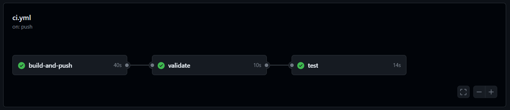

# UFSCar - ML in Production - EML2 - Atividade 1

## Projeto de classificação de Iris com esteira de CI com Actions do GitHub

Este repositório contém o código e os artefatos para a atividade 1 do módulo 2 de Engenharia de Machine Learning, parte do curso de pós-graduação *ML in Production* da UFSCar. O projeto consiste em um modelo de Machine Learning para classificar flores Iris, uma API Flask para predição online, Docker para containerização da aplicação e esteira de CI (Continuous Integration) com três jobs de build, validação e teste.

## Estrutura do repositório

```
/ufscar-mlp-eml2-ativ1
├── Dockerfile
├── README.md
├── iris_model.pkl
├── requirements.txt
└── src
    ├── __init__.py
    ├── app.py
    ├── model.py
    └── tests
        ├── test_app.py
        └── test_model.py
```

## Pré-requisitos

Antes de começar, você precisará ter o Docker instalado em sua máquina. Você pode instalar o Docker seguindo as instruções no [site oficial do Docker](https://www.docker.com/products/docker-desktop).

## Como Rodar o Projeto

### Passo 1: Clonar o repositório

Clone o repositório para sua máquina local usando:

```bash
git clone https://github.com/plbalmeida/ufscar-mlp-eml2-ativ1.git
```

### Passo 2: Treinar o modelo de ML

Executar o seguinte comando:

```
python src/model.py
```

É esperado que o arquivo `iris_model.pkl` seja gerado na raíz do diretório do repositório.

### Passo 3: Execução da esteira de CI

Faça o push utilizando o seguinte comando para a branch `main` do repositório:

```
git push
```

É esperado que o pipeline de CI no Actions do GitHub seja executado com sucesso.



O pipeline de CI definido no GitHub Actions organiza o fluxo de trabalho em três etapas principais, começando pela verificação de lint, seguido por testes e, por fim, construção e envio da imagem Docker. Aqui está um resumo de cada job e o que eles fazem:

#### `lint`
**Objetivo**: Validar o código-fonte usando ferramentas de linting.
- **Checkout code**: Esta etapa clona o código-fonte do repositório GitHub para o ambiente do runner do GitHub Actions.
- **Setup Python**: Configura a versão do Python para a execução no runner.
- **Install dependencies**: Instala todas as dependências necessárias definidas no `requirements.txt`.
- **Run Flake8**: Executa o linter `flake8` para verificar a conformidade do código com as diretrizes de estilo, ajudando a garantir que não contenham erros básicos de sintaxe ou estilo.

#### `test`
**Objetivo**: Executar testes automatizados para verificar a funcionalidade do código.
- **Dependências**: Este job depende do sucesso do job `lint`, garantindo que os testes só ocorram após a validação bem-sucedida do código.
- **Checkout code**: Clona novamente o código-fonte para garantir que os testes sejam executados na versão mais atual.
- **Setup Python**: Prepara o ambiente Python especificado.
- **Install dependencies**: Instala as dependências necessárias para os testes.
- **Run tests**: Executa os testes unitários configurados no diretório `tests` do projeto, garantindo que o código funcione conforme esperado.

#### `build-and-push`
**Objetivo**: Construir e enviar uma imagem Docker para um registro Docker (Docker Hub).
- **Dependências**: Depende do sucesso do job `test`, assegurando que a imagem Docker só seja construída e enviada após os testes passarem.
- **Checkout code**: Clona o código-fonte para o ambiente do runner.
- **Set up Docker Buildx**: Prepara o Buildx como o builder Docker no runner, permitindo a construção de imagens Docker multi-plataforma.
- **Log in to Docker Hub**: Autentica no Docker Hub usando credenciais armazenadas como segredos no GitHub, permitindo que o runner faça o push da imagem para o repositório.
- **Build and push Docker image**: Constrói a imagem Docker baseada no `Dockerfile` localizado na raiz do diretório do projeto e envia a imagem para o Docker Hub com a tag especificada.

Cada job está claramente definido para lidar com uma fase específica do ciclo de desenvolvimento:
- **Lint**: foca na qualidade do código e conformidade com padrões de codificação.
- **Test**: foca na corretude e funcionalidade do código através de testes automatizados.
- **Build-and-push**: foca na preparação e disponibilização da imagem Docker.

Este fluxo garante que cada push no branch `main` passe por um processo rigoroso de CI, ajudando a manter a qualidade e a estabilidade do código no projeto.

# Contribuições

Contribuições são bem-vindas. Para contribuir, por favor, crie um pull request para revisão.

