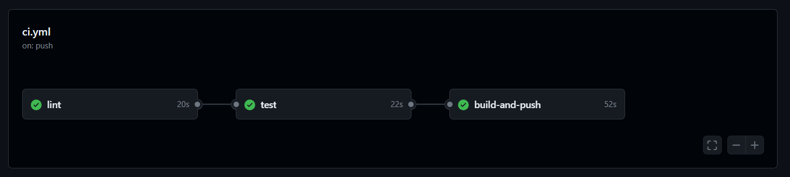

# UFSCar - ML in Production - EML2 - Atividade 1

## Projeto de classificação de Iris com esteira de CI com Actions do GitHub

Este repositório contém o código e os artefatos para a atividade 1 do módulo 2 de Engenharia de Machine Learning, parte do curso de pós-graduação *ML in Production* da UFSCar. O projeto consiste em um modelo de Machine Learning para classificar flores Iris, uma API Flask para predição online, Docker para containerização da aplicação e esteira de CI (Continuous Integration) com três jobs de build, validação e teste.

## Estrutura do repositório

```
/ufscar-mlp-eml2-ativ1
├── Dockerfile
├── README.md
├── iris_model.pkl
├── requirements.txt
└── src
    ├── __init__.py
    ├── app.py
    ├── model.py
    └── tests
        ├── test_app.py
        └── test_model.py
```

## Pré-requisitos

Antes de começar, você precisará ter o Docker instalado em sua máquina. Você pode instalar o Docker seguindo as instruções no [site oficial do Docker](https://www.docker.com/products/docker-desktop).

## Como Rodar o Projeto

### Passo 1: Clonar o repositório

Clone o repositório para sua máquina local usando:

```bash
git clone https://github.com/plbalmeida/ufscar-mlp-eml2-ativ1.git
```

### Passo 2: Treinar o modelo de ML

Executar o seguinte comando:

```
python src/model.py
```

É esperado que o arquivo `iris_model.pkl` seja gerado na raíz do diretório do repositório.

### Passo 3: Execução da esteira de CI

Faça o push utilizando o seguinte comando para a branch `main` do repositório:

```
git push
```

É esperado que o pipeline de CI no Actions do GitHub seja executado com sucesso.



O pipeline de CI definido no GitHub Actions possui três jobs principais que orquestram o fluxo de trabalho desde a construção da imagem Docker até a validação do código e execução de testes. Aqui está um resumo de cada job e o que eles fazem:

#### `build-and-push`
**Objetivo**: Construir e enviar uma imagem Docker para um registro Docker (Docker Hub).
- **Checkout code**: Esta etapa clona o código-fonte do repositório GitHub para o ambiente do runner do GitHub Actions.
- **Set up Docker Buildx**: Configura o Buildx como o builder Docker no runner, o que permite construir imagens Docker multi-plataforma.
- **Log in to Docker Hub**: Autentica no Docker Hub usando credenciais armazenadas como segredos no GitHub, permitindo que o runner faça o push de imagens para o repositório.
- **Build and push Docker image**: Constrói a imagem Docker baseada no `Dockerfile` localizado na raiz do diretório do projeto e envia a imagem para o Docker Hub com a tag especificada.

#### `validate`
**Objetivo**: Validar o código-fonte usando ferramentas de linting.
- **Dependências**: Este job só é executado após a conclusão bem-sucedida do job `build-and-push`.
- **Checkout code**: Repete o processo de clonar o código-fonte para assegurar que as verificações de linting são feitas na versão mais atual do código.
- **Run linting tools**: Executa ferramentas de linting (neste caso, `flake8`) dentro de um container Docker baseado na imagem que foi construída e enviada no primeiro job. Essa etapa é crucial para garantir que o código siga as diretrizes de estilo e não contenha erros básicos de sintaxe.

#### `test`
**Objetivo**: Executar testes automatizados para verificar a funcionalidade do código.
- **Dependências**: Depende do sucesso do job `validate`, garantindo que os testes só ocorram após a validação bem-sucedida do código.
- **Checkout code**: Novamente, clona o código-fonte para o ambiente do runner.
- **Log in to Docker Hub**: Autentica novamente no Docker Hub para possibilitar a execução de containers baseados na imagem Docker previamente enviada.
- **Docker Run**: Executa os testes unitários configurados no diretório `tests` do projeto, dentro do container Docker, utilizando a imagem Docker que foi construída. A variável de ambiente `PYTHONPATH` é configurada para assegurar que o Python reconheça o diretório correto para importações de módulos durante os testes.

Cada job está claramente definido para lidar com uma fase específica do ciclo de desenvolvimento:
- **Build-and-push**: foca na preparação e disponibilização da imagem Docker.
- **Validate**: foca na qualidade do código e conformidade com padrões de codificação.
- **Test**: foca na corretude e funcionalidade do código através de testes automatizados.

Este fluxo garante que cada push no branch `main` passe por um processo rigoroso de CI, ajudando a manter a qualidade e a estabilidade do código no projeto.

# Contribuições

Contribuições são bem-vindas. Para contribuir, por favor, crie um pull request para revisão.

